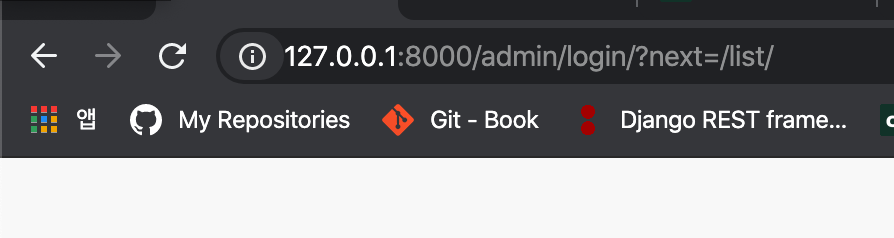
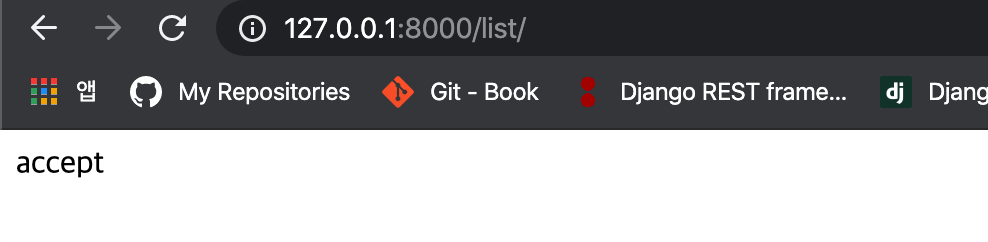

# Django 모델

- **[Permissions](#permission)**


<br>

**[처음으로](#20xxxx)**
<br>


## Django Permission

-   django에서 사용자 정의 유저를 생성하고, admin에서 Permission을 제어하기 위함


### example code

**models.py**

```python
# blog.models.py
class UserManager(BaseUserManager):
    def create_user(self, **kwargs):
        user = self._default_set(**kwargs)
        self._add_permissions(user)
        return user

    def create_superuser(self, **kwargs):
        user = self._default_set(**kwargs)
        self._add_permissions(user, is_admin=True)
        return user

    def _default_set(self, **kwargs):
        user = self.model(**kwargs)
        password = kwargs.get('password', None)
        if password:
            user.set_password(password)
        user.save(using=self._db)
        return user

    def _add_permissions(self, obj, include_default=True, is_admin=False):
        content_type = ContentType.objects.get_for_model(obj.__class__)

        if include_default:  # 자동으로 생성된(add, change, delete, view) permissions 포함
            if is_admin:
                permissions = Permission.objects.all()
            else:
                permissions = Permission.objects.filter(content_type=content_type)

            for permission in permissions:
                obj.user_permissions.add(permission)
        else:  # Meta에 정의된 permissions
            for permission in self.Meta.permissions:
                pm = Permission.objects.get(codename=permission[0], content_type=content_type)
                obj.user_permissions.add(pm)


class ParentUser(AbstractBaseUser, PermissionsMixin):
    username = models.CharField(max_length=15, unique=True)

    # is_superuser = models.BooleanField(default=False)
    is_active = models.BooleanField(default=True)
    is_admin = models.BooleanField(default=False)

    objects = UserManager()

    USERNAME_FIELD = 'username'
    REQUIRED_FIELDS = ['password']

    def __str__(self):
        return self.username

    @property
    def is_staff(self):
        return self.is_admin

    class Meta:
        abstract = True


class ChildUser(ParentUser):
    class Meta:  # migrate 시점에 auth_permission db에 저장
        permissions = [
            ("change_task_status", "Can change the status of tasks"),
            ("close_task", "Can remove a task by setting its status as closed"),
        ]
```

-   AbstractBaseUser 기반 사용자 모델 설정
-   Permission 관련 기능을 상속받기 위해 [PermissionsMixin](https://docs.djangoproject.com/en/3.1/topics/auth/customizing/#django.contrib.auth.models.PermissionsMixin)을 추가
    -   PermissionsMixin은 [ModelBackend](https://docs.djangoproject.com/en/3.1/ref/settings/#auth)와 연결되어있어서 PermissionMixin에서 제공하는 메서드는 오버라이딩하지 않고 그대로 사용함
-   추상 클래스(ParentUser)를 상속받아 사용자 User 모델(ChildUser)을 생성
    -   데이터베이스의 auth_permission 테이블에 추가할 권한들을 Meta 클래스에 작성
    -   migrate 시 테이블에 반영된다.

<br>

위 코드는 create_user 메서드를 이용해 사용자를 생성할 때 자동으로 permission을 해당 유저 객체에 추가할 수 있도록 UserManager를 구성함

-   사용자 객체에 권한을 추가할 경우 아래와 같은 순서로 추가할 수 있다.

    ```python
    >>> user = ChildUser.objects.first()
    >>> user.has_perm('blog.close_task')
    False
    >>> ct = ContentType.objects.get_for_model(ChildUser)
    >>> ct
    <ContentType: blog | child user>
    >>> pm = Permission.objects.get(codename='close_task', content_type=ct)
    >>> user.user_permissions.add(pm)
    >>> user.has_perm('blog.close_task')
    True
    ```

    -   **auth_permission** 테이블은 기본적으로 id, content_type_id, codename, name으로 구성된다.

    -   **get_for_model** 메서드를 이용해 권한의 대상이 되는 ConentType 객체(ct)를 가져오고, 권한을 부여할 때 사용한다.

    -   권한 객체를 가져올 때 codename과 content_type 파라미터를 이용한다.

        -   권한 - codename: 권한을 호출하기 위해 사용되는 이름. name은 권한을 설명하는 문장을 의미한다.
        -   대상 - content_type

    -   위 예제처럼 PermissionsMixin.has_perm 메서드를 통해 해당 객체가 권한을 가졌는지 확인하거나 MyUser.has_perm 처럼 has_perm 메서드를 오버라이딩해서 사용할 수 있다.

        <br>

        -   django의 PermissionsMixin.has_perm 내부 코드

        ```python
        # django/contrib/auth/models.py
        
        class PermissionsMixin(models.Model):
            def has_perm(self, perm, obj=None):
                # Active superusers have all permissions.
                if self.is_active and self.is_superuser:
                    return True
        
                # Otherwise we need to check the backends.
                return _user_has_perm(self, perm, obj)  
        
        def _user_has_perm(user, perm, obj):
            """
            A backend can raise `PermissionDenied` to short-circuit permission checking.
            """
            for backend in auth.get_backends():
                if not hasattr(backend, 'has_perm'):
                    continue
                try:
                    if backend.has_perm(user, perm, obj):
                        return True
                except PermissionDenied:
                    return False
            return False
        ```

        

**views.py**

```python
@login_required
def test_view(request):
    if request.user.has_perm('blog.add_childuser'):
        # do something
        ...
    else:
        # redirect previous page
        ...
        
# 또는
@permission_required('blog.close_task', login_url='/admin/login/')
def test_view(request):
    return HttpResponse('accept')
```

-   has_perm 메서드는 반드시 유저를 식별할 수 있도록 로그인 이후에 사용되어야 한다.
    -   로그인 전 user는 AnonymousUser이므로 어떠한 권한도 검색할 수 없음
-   @permission_required 데코레이터를 이용해 권한에 따른 접근을 제어할 수 있다.


**login 전(login 페이지로 리다이렉팅)**




**login 후**



