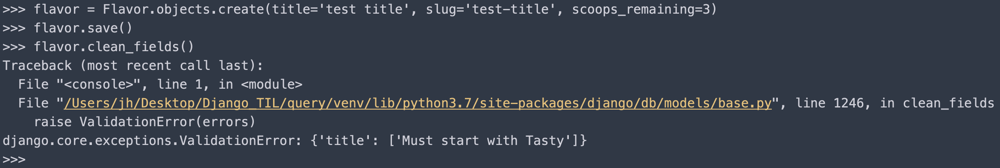

# 201027 - 폼에서 사용할 수 있는 여러가지 패턴

<br>

## 모델폼에서 커스텀 폼 필드 유효성 검사기 이용

**프로젝트의 모든 앱 타이틀 필드가 'Tasty'로 시작되어야 할 경우 - 유효성 검사**

-   validators.py

    ```python
    from django.core.exceptions import ValidationError
    
    def validate_tasty(value):
        if not value.startswith(u"Tasty"):
            msg= u"Must start with Tasty"
            raise ValidationError(msg)
    ```

    <br>

-   models.py

    ```python
    class TastyTitleAbstractModel(models.Model):
        title = models.CharField(max_length=255, validators=[validate_tasty])
    
        class Meta:
            abstract = True
    
    
    class Flavor(TastyTitleAbstractModel):
        slug = models.SlugField()
        scoops_remaining = models.IntegerField(default=0)
    
        def get_absolute_url(self):
            return reverse("flavors:detail", kwargs={"slug": self.slug})
    
    ```

    <br>

-   views.py

    ```python
    class FlavorCreateView(LoginRequiredMixin, CreateView):
        model = Flavor
        fields = ['title', 'slug', 'scoops_remaining']
    
    
    class FlavorUpdateView(LoginRequiredMixin, UpdateView):
        model = Flavor
        fields = ['title', 'slug', 'scoops_remaining']
    ```

<br>

-   테스트 결과

    

    -   title이 'Tasty'로 시작하지 않을 경우 ValidationError가 발생한다.

    

-   다른 필드에 적용 가능하며 폼에서 validator를 이용할 경우

    -   forms.py

        ```python
        from django import forms
        
        from blog.models import Flavor
        from blog.validators import validate_tasty
        
        
        class FlavorForm(forms.ModelForm):
            def __init__(self, *args, **kwargs):
                super().__init__(*args, **kwargs)
                self.fields['title'].validators.append(validate_tasty)
                self.fields['slug'].validators.append(validate_tasty)
        
            class Meta:
                model = Flavor
        ```

        -   django의 모델 기반 수정는 뷰의 모델 속성을 기반으로 자동으로 폼을 생성한다.	
        -   따라서 view에 form_class를 오버라이딩하여 FlavorForm을 명시적으로 사용해야한다.

    -   views.py

        ```python
        class FlavorActionMixin:
            model = Flavor
            fields = ['title', 'slug', 'scoops_remaining']
        
            @property
            def success_msg(self):
                return NotImplemented
        
            def form_valid(self, form):
                messages.info(self.request, self.success_msg)
                super().form_valid(form)  # form_class에 등록된 form(FlavorForm)의 메서드를 호출
        
        
        class FlavorCreateView(LoginRequiredMixin, FlavorActionMixin, CreateView):
            success_msg = 'created'
            form_class = FlavorForm
        
        
        class FlavorUpdateView(LoginRequiredMixin, FlavorActionMixin, UpdateView):
            success_msg = 'updated'
            form_class = FlavorForm
        
        
        class FlavorDetailView(DetailView):
            model = Flavor
        ```

        -   FlavorCreateView와 FlavorUpdateView는 FlavorForm을 이용해 유효성 검사를 진행한다.

    


<br>

## 유효성 검사의 클린 상태 오버라이딩

**다중 필드에 대한 유효성 검사**

**유효성 검사가 끝난 데이터베이스의 데이터가 포함된 유효성 검사**

-   기본 또는 커스텀 필드 유효성 검사기가 실행된 후([run_validators()](https://docs.djangoproject.com/ko/3.1/ref/forms/validation/)), clean() 또는 clean\_\<field_name\>메서드를 이용해 입력된 데이터의 유효성 검사 진행

    -   clean()에서는 이미 유효성 검사를 마친 데이터에 대해 유효성 검사 진행함 - 불필요한 db 연동을 줄일 수 있다.

        ```python
        class IceCreamOrderForm(forms.Form):
            slug = forms.ChoiceField(label=Flavor)
            topping = forms.CharField()
        
            def __init__(self, *args, **kwargs):
                super().__init__(*args, **kwargs)
                self.fields['slug'].choices = [(x.slug, x.title) for x in Flavor.objects.all()]
        
            def clean_slug(self):
                slug = self.cleaned_data['slug']
                # 유효성 검사가 끝난 slug 필드를 이용해 특정 Flavor 객체의 유효성 검사
                if Flavor.objects.get(slug=slug).scoops_remaining <= 0:
                    msg = u"Sorry, we are out of that flavor"
                    raise forms.ValidationError(msg)
                return slug
        
            def clean(self):
                cleaned_data = super().clean()
                slug = cleaned_data.get('slug', '')
                toppings = cleaned_data.get('topping', '')
        
                if u'chocolate' in slug.lower() and u'chocolate' in toppings.lower():
                    msg = u"Your order has too much chocolate."
                    raise forms.ValidationError(msg)
                return cleaned_data
        ```

        -   clean\_\<field_name\>에서 forms 에러가 발생할 경우 HTML 입력 필드에 에러 메세지를 출력

            

## 폼필드 해킹

-   하나의 모델에 두 개의 뷰와 폼이 엮여 있는 경우

    ```python
    # models.py
    class IceCreamStore(models.Model):
        title = models.CharField(max_length=100)
        block_address = models.TextField()
        phone = models.CharField(max_length=20, blank=True)
        description = models.TextField(blank=True)
    
        def get_absolute_url(self):
            return reverse("store_detail", kwargs={'pk': self.pk})
          
          
    # forms.py
    class IceCreamStoreCreateForm(forms.ModelForm):
        class Meta:
            model = IceCreamStore
            fields = ['title', 'block_address']
    
    
    class IceCreamStoreUpdateForm(IceCreamStoreCreateForm):
        def __init__(self, *args, **kwargs):
            super().__init__(*args, **kwargs)
            self.fields['phone'].required = True
            self.fields['description'].required = True
    
        class Meta(IceCreamStoreCreateForm.Meta):
            fields = ['title', 'block_address', 'phone', 'description']
            
            
    # views.py
    class IceCreamCreateView(CreateView):
        model = IceCreamStore
        form_class = IceCreamStoreCreateForm
        
    class IceCreamUpdateView(UpdateView):
        model = IceCreamStore
        form_class = IceCreamStoreUpdateForm
    ```

    >   Meta.exclude는 절대 사용하지 말것


## 재사용 가능한 검색 믹스인 뷰

-   각기 다른 두 개의 모델에 연동되는 두 개의 뷰 + 하나의 폼(html form)

    ```python
    # views.py
    class TitleSearchMixin:
        def get_queryset(self):
            queryset = super().get_queryset()
            q = self.request.GET.get('q')
            if q:
                return queryset.filter(title__icontains=q)
            return queryset
    
    class FlavorListView(TitleSearchMixin, ListView):
        model = Flavor
    
    class IceCreamListVIew(TitleSearchMixin, ListView):
        model = IceCreamStore
    ```

    

